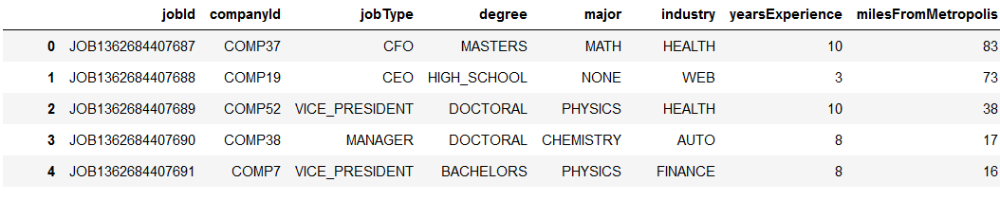

# Salary Prediction Project

## Introduction
A hypothetical data science consulting firm is working on a new project to develop a model that  predicts the salaries of jobs in a US city based on information such as the job type(i.e janitor to CEO), the job industry, the location of the job relative to the metropolis, the level of education of the worker, the type of degree held if any and the years of experience of the worker.

The goal of the project is to train a model on a data set of one million jobs containing details outlined above and use it to predict the salaries on a different data set of job posts.  The model is required to have a mean squared error(MSE) score less than 360.  

The train set consist of two separate csv files( one for the features and one for the target- salaries). The Features in data set are as follows:
- jobId - Unique job identifier
- companyId - Id for different companies
- jobtype - level of job ranging from janitor to CEO
- degree  - degree held if any
- major - major studied if any
- industry - job industry (e.g auto, finance, service)
- yearExperience - number of years experience of the worker
- milesFromMetropolis - how far the job was from the city's metropolis

The target file consist of the jobId and the Salaries

The test set is a single csv file with the features listed above

The task has been divided in to 5 steps(each completed in a separate file):

## 1. Data Cleaning and Processing (file: 1_DataPrep_salary_pred.ipynb) 
The  two csv files for the train set were converted into pandas dataframe objects. Basic summary stats of each data set was carried out which showed  that both data set contained 1000000 rows each which with a unique identifier. The summary stat also showed that the features and target have the right data types. For example _yearsExperience_, _milesFromMetropolis_ and _salary_  all have intergers values, while the values for other features are of the object data type. Additionally, the summary stat showed that the salary dataframe contained zero value(s). zero salary values seems incorrect unless there are volunteer jobs in data set, but no information was given as regards this. The first five rows of each dataframe are shown below.

For the features with the object data types, the values were checked for case uniformity as python interprets for example Auto, AUTO and auTo as different values. The cases were found to be uniform(all uppercases) across all feature values. Next, both dataframes were checked for missing values ( counting empty strings as missing values) and none were found. Both data sets were then checked for duplicates. As expected, there were no duplicates found since each contains a unique job identifiers in the jobid column. On the features data however, when the jobid column was removed, 8001 duplicates were found.

The features and the target dataframes were then merged on the _jobId_ column. Again, we checked for duplicates on the merge data after dropping _jobId_ column and only 186 duplicates were found now. The fact that we found 8001 duplicates on the features data and only 186 duplicates on the merged data means that there are many cases of jobs postings with the exact same features but with different salaries. This is explored further in EDA.
 The merged data was then checked for salary values less that or equal to zero. Five of these were found and the correspoding rows were removed as they provide no useful information and might affect the accuracy of our model. The data was checked for duplicates again; 186 duplicates were still found and these were removed.

## 2. Exploratory Data Analysis (file: 2_EDA_salary_pred.ipynb) 
Here the cleaned data from the previous step is explored to identify patterns between features and target. As mentioned earlier 8001 duplicate rows were found in the features data and only 186 duplicates found in the merged data, which means that there are many cases of the same feature values combinations with different salaries. The table below gives some instances(over 7000 in total), and as can be seen the differences in the salary values are quite significant in some cases(see first row for example). Although this was not carried out but identified as a future work, one could use K Nearest Neighours to select the most accurate of the duplicates. For now what was done was to leave the data as-is and see if it results in a significant different in the performance of our model with the duplicates removed.

  
  
Next the distribution of the values in each feature was graphed. This will let us know if our data is balanced and if we can be confident of the insights we gather during EDA. We see that the occurence of values in each feature is balanced except for 'NONE' in the _majors_ feature which has about five times more level of occurence than other _major_ values. Examining further we deduce that the reason for this is that each degree type other than 'HIGH_SCHOOL' and 'NONE' degree types are distributed uniformly across all major types. 'HIGH_SCHOOL' and 'NONE' degree types however are exclusively associated with 'NONE' major.

Next we plot series of graphs of different feature combinations against their averaged salaries. For example, we group the data by industry and jobtype, and with the graph(shown below) we are able to see the average salaries for each jobtype in a particular industry. 

From the graph plots we were able to deduce general trends for each feature as folllows:

_jobType_ - average salaries increase in the following order: JANITOR, JUNIOR, SENIOR, MANAGER, VICE_PRESIDENT, CFO, CTO, CEO

_degree_ - average salariies increase in the following order: NONE, HIGH_SCHOOL, BACHELORS, MASTERS, DOCTORAL

_industry_ - average salaries increase in the following order: EDUCATION, SERVICE, AUTO, HEALTH, WEB, FINANCE, OIL

_distanceFromMetropolis - average salaries decreased as the distance from the metropolis increased

-yearsExperience - average salaries increased as years of experience increased

_companyid_ - No discernable trend

_major_ - salaries generally increase in the following order: NONE, LITERATURE, BIOLOGY, CHEMISTRY, PHYSICS, COMPSCI, MATH, BUSINESS, ENGINEERING 
The graph of majors and industry(shown below) provided some interesting insights on closer look. We clearly see that _NONE_ major have the lowest average salary in any industry. We also see that the general trend above does not apply. For example even though Literature majors have the second lowest average salary generally, they have the highest average salary in the Education industry, and Chemistry and Biology majors have the two highest average salaries in the Health industry. So we can conclude that one's major will have a an impact on salary earned in any particular industry.

## 3 Preprocessing for Modelling (file: 3_Prepoc_salary_pred.ipynb) 
Using insights from EDA, the features with object data types were ordinally econded. Though we did not observe any particular variation of companyId with average salaries, we have encoded it as well to see its effect on our model's performance. In addition, two features were engineered from _yearsExperience_ and _milesFromMetropolis_ features. The _yearsExperience_ values were binned into six groups(range is 1 to 24 years) and the _milesFromMetropolis_ binned into 10 groups (range is 1 to 99). The table below shows a snip of the data with the newly egineered features(not all columns are shown). The ordinal ecoder object of each feature is also saved in a dictionary for use on the test data set.

 

## 4. Modelling (file: 4_Models_salary_pred.ipynb) 
In developing models, a portion of the processed data (20%) was reserved for testing while the remainder was used in training models. The MSE which was chosen as the performance metric of the model is based on the difference between the predicted salaries of the test data compared with actual salaries.    

Linear regression models were explored as a base model.The graph below shows the peformance of a first, second and third order linear regression models. As the graph shows, there is significant improvement in MSE from the first order model to the second order model(397 to 369), but much less improvement to the third order model(367). Higher order models(not shown in the graph) resulted in even less improvement in MSE but at much larger computational cost. 

A decision tree model and three ensemble models (random forest, gradient boosting and XGBoost) were then explored as improvement on the base model. The hyperperameters of each model were tuned via a gridsearch to obtain optimum values. A 5-fold cross validatation was done to validate each model and results across folds  were consistent for each model. The data was then divided into a train/test split (80/20) and the MSE of each model on the test data was obtained. The Decision tree model had the worst performance with an MSE of 388, the random forest model had an MSE of 364, the gradient boost had an MSE of 356 and the xtreme gradient boost model had an MSE of 355,  marginally better than the gradient boost model.The xtreme gradient boost model was therefore selected as the final model and the predictive importance of each feature is shown in the graph below.

 

During EDA we talked about duplicate feature values with different salaries(around 15000 rows). We tried removing the duplicates including the 'originals' but there was no improvement in the MSE of the model. 

## 5. Pipeline (file: 5_Pipeline_salary_pred.ipynb)
A script was written which automates the cleaning, prepocessing and modelling of the train data. With the train feature file path and the target file path as its input argument, the function converts the data set into pandas dataframes, cleans the data, checks for missing values and removes them, check for case uniformity and corrects if non-uniformity is detected, merges the feature and target data on the the jobId column, drops the jobId column, then removes duplicates and rows with zero salary values. The values of each feature are then ordinally encoded and captured in new columns added to the dataframe, and the encoder objects are saved in a dictionary. The entire data is then trained on the xgboost model and an object of the model is saved.

A second script which takes the file path of the test data set as it input argument was aslo written. The function converts the test data csv file into a pandas dataframe, checks for case uniformity and corrects if necessary, and then removes duplicates after droping the jobId column. Using the saved ordinal encoder objects, values of each feature are encoded in new columns and the saved xgboost model is then use to predict the salaries of the test data. The predicted salaries are added to test dataframe which is saved as a csv file, a snip of which is shown below.

## 6. Deployment (folder: Docker_flask_app)
A flask app of the model was built in a docker container and tested locally. The dockerized flask app was then deployed with AWS Beanstalk allowing users interact via a web page. A screen shot of the app is shown below.

## Additions
A module (helper.py) which contains various functions written for each of the step above was created. At the beginning of each notebook, the helper module and the required functions are imported

# Future Works:
1. During EDA over 15000 rows were found with duplicate features but different salaries. This needs further analysis probably using KNN to select more accurate values
2. Engineering new features to Improve  MSE of model
3. Scale numeric features and observe performance
3. Use objected oriented programming for added scalability and flexibility
4. Build dockerized flask app and deploy on AWS 